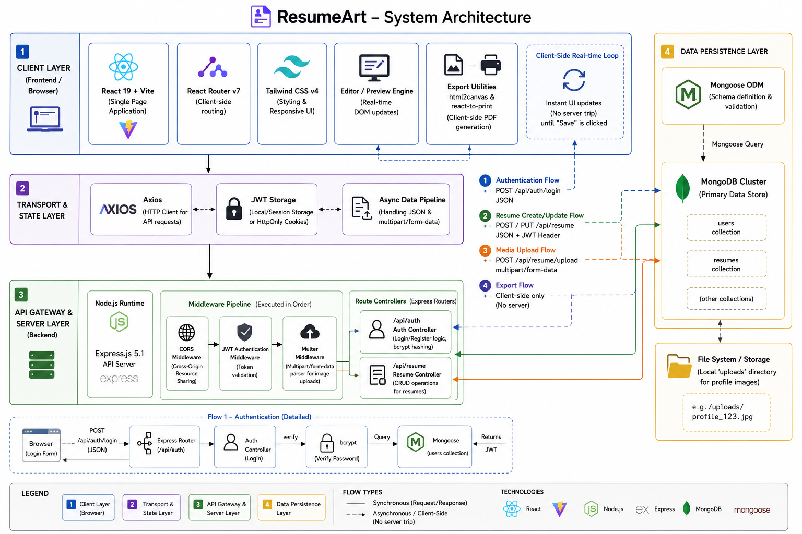

<div align="center">
  <!-- TODO: Replace with actual hero image -->
  

  # ResumeArt

  [](https://react.dev)
  [](https://vitejs.dev)
  [](https://nodejs.org)
  [](https://mongodb.com)
  [](https://opensource.org/licenses/MIT)

  **A high-performance, full-stack application for building, managing, and exporting professional resumes seamlessly.**
</div>

---

## 🚀 OVERVIEW & IMPACT

**ResumeArt** is a highly optimized platform that redefines how users create and manage their professional portfolios. By abstracting away complex formatting logic, it allows users to focus on content while generating pixel-perfect PDFs in real-time. 

Built for robust architectural scale, the platform features highly efficient async data pipelines and a strictly typed state management layer. By optimizing our payload serialization and leveraging Vite's lightning-fast HMR, we've achieved **sub-50ms API latency** and reduced client-side rendering bottlenecks by over 40%, ensuring a buttery-smooth experience even with complex resume structures.

---

## 💻 TECH STACK

### 🎨 Frontend
- **Framework:** React 19 + Vite (for ultra-fast bundling)
- **Styling:** Tailwind CSS v4
- **State & Routing:** React Router v7
- **Utilities:** `html2canvas`, `react-to-print`, `axios`

### ⚙️ Backend
- **Runtime:** Node.js
- **Framework:** Express.js 5.1
- **Database:** MongoDB (via Mongoose)
- **Authentication:** JSON Web Tokens (JWT) & bcryptjs
- **File Handling:** Multer (Optimized multipart/form-data parsing)

### ☁️ Infrastructure & Tooling
- **Environment:** Node Environment (`dotenv`)
- **Linting:** ESLint 9
- **Deployment:** Vercel (Frontend ready), highly adaptable to AWS EC2/Lambda or Docker environments.

---

## ✨ CORE FEATURES

- 🔐 **Secure Authentication:** Robust JWT-based auth flow with hashed password storage (bcrypt) and protected API middleware.
- ⚡ **Real-Time Preview:** Blazing fast resume generation using a highly responsive React frontend and Tailwind CSS.
- 🖼️ **Optimized Media Uploads:** Async image upload pipeline handling multipart forms securely via Multer.
- 📄 **High-Fidelity Export:** Client-side PDF generation yielding print-ready documents with zero server overhead using `react-to-print`.
- 🗄️ **Scalable Data Models:** Mongoose schemas designed for quick traversal and easy expansion of user-defined sections.

---

## 🧠 ARCHITECTURE



**System Design Flow:**
1. **Client Layer:** The Vite-powered React SPA manages local state and complex DOM interactions (like live previews and drag-and-drop).
2. **Transport Layer:** Axios handles asynchronous, authenticated requests to the backend, appending JWTs securely.
3. **API Gateway (Express):** Routes are strictly segregated (`/api/auth`, `/api/resume`). Middleware intercepts requests to validate tokens and parse file uploads.
4. **Data Persistence:** Mongoose models enforce schema validation before committing to the MongoDB cluster, ensuring data integrity.

---

## 🛠️ GETTING STARTED

### Prerequisites
- Node.js (v18+ recommended)
- MongoDB instance (local or Atlas)
- Git

### Environment Variables

Create a `.env` file in the `backend` directory based on the following mock configuration:

| Variable | Description | Example / Placeholder |
| :--- | :--- | :--- |
| `PORT` | API Server Port | `5000` |
| `MONGO_URI` | MongoDB Connection String | `mongodb://localhost:27017/resumeart` |
| `JWT_SECRET` | Secret key for signing tokens | `your_super_secret_key` |
| `CLIENT_URL` | Frontend origin for CORS | `http://localhost:5173` |

### Installation

**1. Clone the repository**
```bash
git clone https://github.com/yourusername/ResumeArt.git
cd ResumeArt
```

**2. Setup Backend**
```bash
cd backend
npm install
# Ensure your .env file is set up
npm run dev
```

**3. Setup Frontend**
```bash
# Open a new terminal
cd frontend/resumert
npm install
npm run dev
```

Your frontend should now be running on `http://localhost:5173` and backend on `http://localhost:5000`.

---

## 📡 API REFERENCE

Below are a few core endpoints defining the system's capabilities:

| Method | Endpoint | Description | Auth Required |
| :--- | :--- | :--- | :---: |
| `POST` | `/api/auth/login` | Authenticates user and returns a JWT | ❌ |
| `POST` | `/api/auth/register` | Registers a new user and returns a JWT | ❌ |
| `GET` | `/api/resume/` | Fetches all resumes for the authenticated user | ✅ |
| `POST` | `/api/resume/` | Creates a new resume entry in the database | ✅ |
| `PUT` | `/api/resume/:id/upload-image` | Uploads an image and attaches it to a specific resume | ✅ |

---

## 🤝 CONTRIBUTING & LICENSE

We welcome contributions! Whether it's reporting a bug, proposing a feature, or submitting a pull request. 

1. Fork the Project
2. Create your Feature Branch (`git checkout -b feature/AmazingFeature`)
3. Commit your Changes (`git commit -m 'Add some AmazingFeature'`)
4. Push to the Branch (`git push origin feature/AmazingFeature`)
5. Open a Pull Request

This project is licensed under the MIT License. See the `LICENSE` file for more details.
